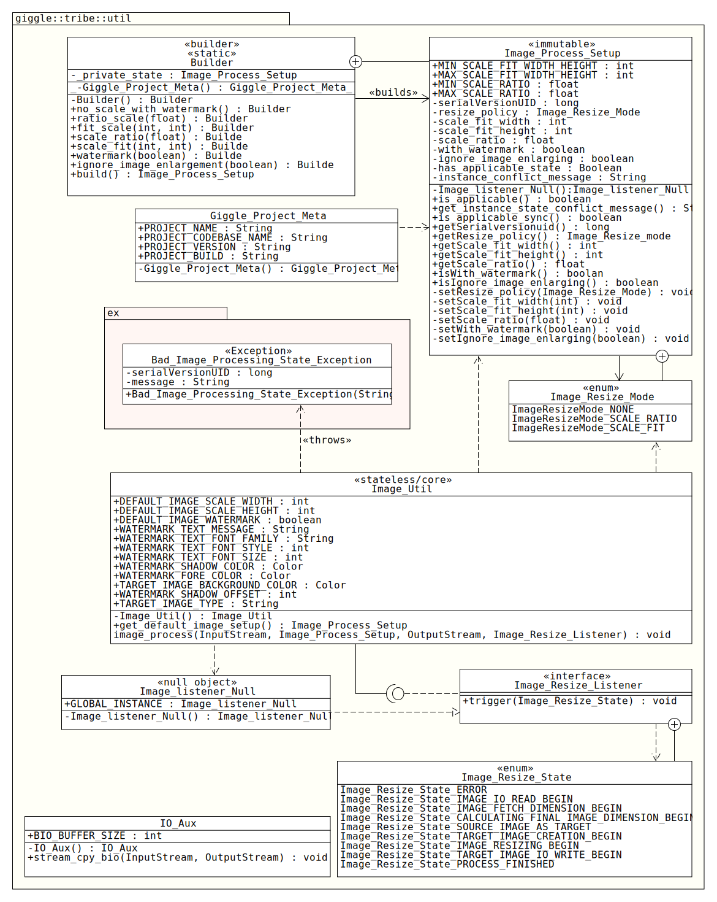

# Giggle Image Lib
Very simple Java image utility(lib)

## Revision History
**Initial Release 0.1** (Feb 15, 2020)
1. Resizing based on constant dimensions, or percent(ratio).
2. Labeling target results using a hard-coded/constant literal at top-left.
3. Ignoring target image creation when no any action required(when target will be as same as source)
4. Ability to reporting/calling back at some process points to make it more useful and easy to use in multi-threaded env, when its called using an async call.

## Requirements
1. Java 1.5 or later
2. Java AWT library (not all JRE profiles come with this lib, you may probably need full-profile)

## Class Diagram


## Library Overview
Considering following items as already implemented functionalities (lib latest version)
### Image Resizing
The main functionality(and actually main reason to start coding the lib). Image resizing option could be provided and set using an `Image_Process_Setup` instance, while it has either constant-fit, or scale-ratio state.
#### Resizing Policy
• Lib keeps the source aspect ratio for target image.  
• User is able to inform lib to ignore resizing op when target image will have the larger dimension of source file(if and if labeling is not a need).  
• Lib has some hard-coded const, to prevent resizing an image when desired target dimension is soo large, or so small(if and if constant-fit resize mode were asked). See file `Image_Process_Setup` for detailed info.  
• User is able to ask lib to scale an image in constant-fit mode, with a pair of possible maximum width and height(or one of them). Lib takes width by default, and may ignore the value(lower val) if relative height is larger than asked value.  
#### Example Resize
**Scenario 0: Fit(constant)-scale when source's dimension aspect is not as same as target's**
Source image dimension: `1000 x 1000` (aspect `1:1`)  
Desired Resize mode: constant-fit as `400 x 600` (aspect `4:6`)  
Resize Policy: fit-scale, watermark, and forced-resize  
Output: `400 x 400` (same aspect as source)  
Available since `v0.1`

**Scenario 1: Fit(constant)-scale when source's dimension aspect is not as same as target's**
Source image dimension: `2000 x 1000` (aspect `2:1`)  
Desired Resize mode: constant-fit as `700 x 700` (aspect `1:1`)  
Resize Policy: fit-scale, watermark, and forced-resize  
Output: `700 x 350` (same aspect as source)  
Available since `v0.1`

**Scenario 2: No any change required(No Watermark, enlarging for resizing, fit-scale mode)**  
Source image dimension: `512 x 256` (aspect `2:1`)  
Desired Resize mode: constant-fit as `1024 x 512` (aspect `2:1`)  
Resize Policy: fit-scale, no watermark, and ignore on enlargment  
Output: no any resizing, and image creation, source file(`512 x 256`) will be marked as output.   
Available since `v0.1`

**Scenario 3: Scale/ratio scale mode**  
Source image dimension: `1920 x 1080` (aspect `16:9`)  
Desired Resize mode: Scale as `2.0f` -> `3840 x 2160` (same aspect as source)  
Resize Policy: Scale, no watermark (note: no-enlarging_resize policy is ignored when by scale resize mode)   
Output: `3840 x 2160` (same aspect as source)  
Available since `v0.1`

### Labeling Image
To adding a label somewhere at target image. Text is not variable, and has been hard-coded into the `Image_Util` class(as `v0.1`), hosted by `WATERMARK_TEXT_MESSAGE` const field, however removing/ignoring label drawing could be specified by related `Image_Process_Setup` instance. As version `v0.1` label will be placed at top-left of the target image.  
Drawing label is done twice, as the first one works as shadow. Fore and shadow colors were set in manner to bring a good contrast.
  
#### Example labeled image (cropped)
**Sample watermark label for `v0.1`**
.jpg)

### Output Artifact
Since `v0.1`  
Type: `jpeg`  
JPEG-Quality: AWT-default (it supposed to be 70%, lib has no any explicit image quality override yet)  
EXIF: AWT-default (EXIF data from source file will be **removed**. Target file will be EXIF-data stripped)  


## Utilizing Library
Considering following steps need to be take in order to utilizing the lib for an image op.  
1. Prepare an instance of `Image_Process_Setup` class, which will carry options/objectives lib need to know how to deal with a resizing request. This class has a private constructor, so cannot be instanciate explicitly. Instead, use it's `Builder` class.

	```java
	/* generating the setup instance, with 50% of input */
	Image_Process_Setup _con_ins = Image_Process_Setup.Builder.ratio_scale(0.49f).watermark(true).build();
	```
2. To avoid possible exception(`Bad_Image_Processing_State_Exception`), check if built instance has any conflict or not(recommended)

	```java
	/* must return true if current state of the instance is one applicable */
	/* Beside being logical statement, it must not violet the policy lib has defined */
	if(_con_ins.is_applicable()){
	/*good to go*/
	}
	```
3. Preparing image source image stream(from a file, stream, whatever)  
4. Preparing target image output stream(to a file, etc...)  
5. (optional) instancing a `Image_Resize_Listener` for handling process more detailed op callbacks  
6. Calling function `image_process` function inside `Image_Util` (note: It's blocking)  

### Example usage
#### Local system image file example
Please refer to [https://github.com/911992/_Giggle_image_util_usage](https://github.com/911992/_Giggle_image_util_usage) repo for a sample usage. It comes with some embedded images for testing.   

#### More Examples ToDo
I hope I could prepare following examples as listed below not so late(or if someone could help, specially about Amazon S3)  
- [ ] Servlet file upload example  
- [ ] Amazon S3/Lambda  

## FAQ
### Is `Image_Util.image_process` thread-safe?
`True`

### Is it safe to use one instance of `Image_Util_Usage` in more than one thread?
`True`, it's immutable. Also note function `image_process` calls `is_applicable_sync()` which is thread-safe, rather than `is_applicable()`

### What are supported image formats as input?
As `V0.1`, java AWT is in charge for loading image(same for writing it). So supported images are `JPEG`, `PNG`, `BMP`, `WBMP`, and `GIT`(probably just first frame).  
Please refer to [https://docs.oracle.com/javase/7/docs/api/javax/imageio/package-summary.html](https://docs.oracle.com/javase/7/docs/api/javax/imageio/package-summary.html)  
**NOTE:** As you like o go for `PNG` type, where transparency is one thing mention. By default(as `v0.1`) Lib fills up the target image with a solid color which is `TARGET_IMAGE_BACKGROUND_COLOR`. If keeping source transparency is an option, find and remove/comment the fill op in `image_process` function

### What color is used to be replaced to transparent pixels in source file?
Please refer to `TARGET_IMAGE_BACKGROUND_COLOR` int class `Image_Util`

### What is default type of output file? What are others supported?
As `V0.1`, default file type for target artifact is `jpeg`. Supported output are depends on AWT supported types, probably as same as supported inputs.  
For changing the type of artifact, change `TARGET_IMAGE_TYPE` inside class `Image_Util` to desired format.  
Please refer to [https://docs.oracle.com/javase/7/docs/api/javax/imageio/package-summary.html](https://docs.oracle.com/javase/7/docs/api/javax/imageio/package-summary.html)

### Will final artifact have same EXIF data as source image? or any EXIF?
No, but depending to AWT implementation, this could be vary. By default it is supposed to EXIF data get stripped.

### Is watermark label customizable?
As `V0.1`, watermark options are hard-coded, and could be changed before any new build with appreciated values. Check `WATERMARK_???` fields in class `Image_Util`

### Is there any forced/explicit graphic rendering hint(s)?
`True`, As `V0.1`, just about smoothing text rendering by enabling text anti-aliasing. Please refer to function `set_graphic_hints` in class `Image_Util`

## Troubleshooting
### Function `image_process` throws `ClassNotFoundException`.
Probably AWT(and dependent) libraries are not included in env/JRE. Make sure you have correct JRE profile installed.  
Please read [https://docs.oracle.com/javase/8/embedded/develop-apps-platforms/compact-profiles.htm](https://docs.oracle.com/javase/8/embedded/develop-apps-platforms/compact-profiles.htm)

